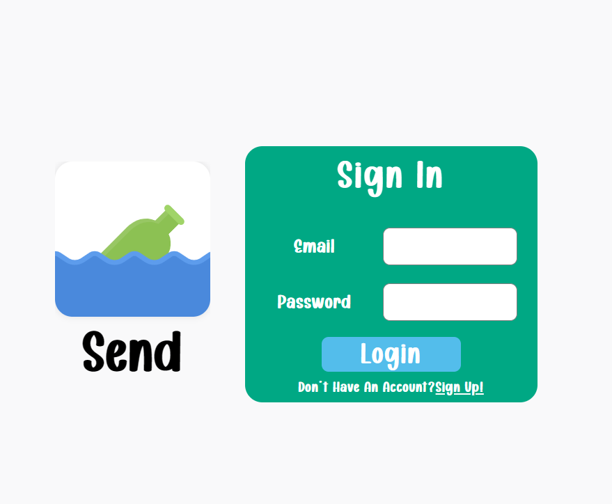
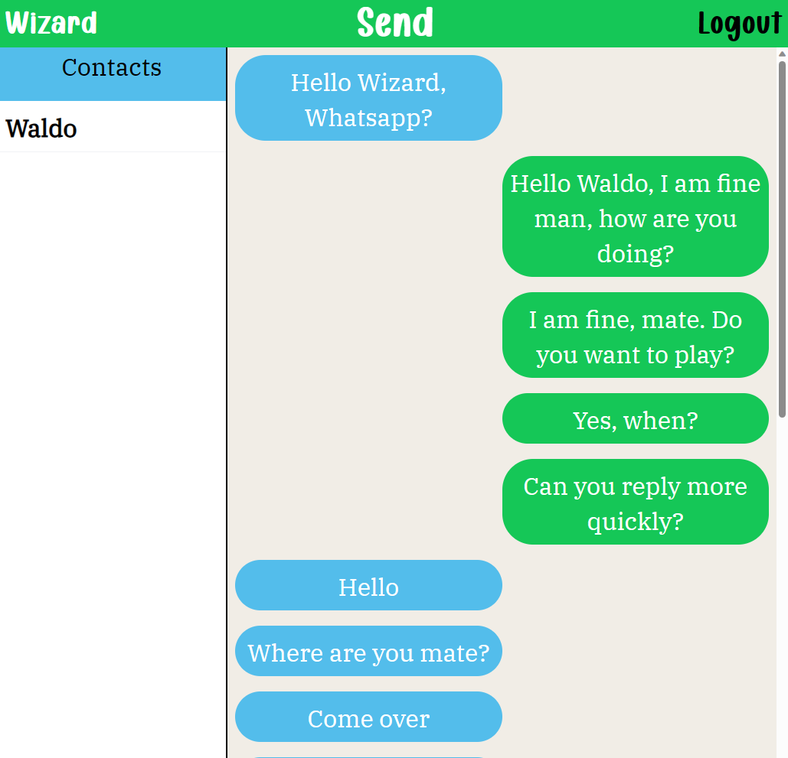

# Messaging App

This application is a messaging platform. It is built with Node.js, which provides the runtime environment, and Express, a popular Node.js framework, to set up the server. MongoDB is used as the database to store messages and user information. The frontend is built with React and React Query that manages the asynchronous data fetching. JWT (JSON Web Tokens) is implemented for user authentication, along with PassportJS for token authentication, ensuring secure access to the application.

### [Live Preview](https://messaging-app-production-6b13.up.railway.app/)

## Features

- Authentication: Securely sign in to your account using JWT.
- Persistent messages: Messages are stored in a MongoDB database and can be retrieved later.

## Technologies Used

- Frontend: React, React Query, CSS
- Backend: Node.js, Express
- Database: MongoDB
- Authentication: JWT

## Getting Started

1. Clone the repository.
2. Install the dependencies with `npm install`.
3. Start the server with `npm run serverstart`.
4. Start the client with `npm run dev`.

## Contributing

Pull requests are welcome. For major changes, please open an issue first to discuss what you would like to change.
